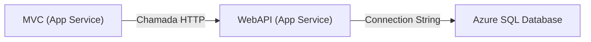

| Aula| SQL | API / MVC | auth | Monitoring |    Synch       | Infra     | Caching     |
| ---| --- | --- | --- | --- |    ---       | ---     | ---     |
| 1 | local | local |     -    |      -     |    síncrono    | az portal |     -       |
| 2 | CLOUD | local |     -    |      -     |    síncrono    | az portal |     -       |
| 3 | CLOUD | CLOUD |     -    |      -     |    síncrono    | az portal |     -       |
| 4 | CLOUD | CLOUD | MS ENTRA |      -     |    síncrono    | az portal |     -       |
| 5 | CLOUD | CLOUD | MS ENTRA | AZ MONITOR |    síncrono    | az portal |     -       |
| 6 | CLOUD | CLOUD | MS ENTRA | AZ MONITOR | MSG/ASSÍNCRONO | az portal |     -       |
| 7 | CLOUD | CLOUD | MS ENTRA | AZ MONITOR | MSG/ASSÍNCRONO | IAAC      |     -       |
| 8 | CLOUD | CLOUD | MS ENTRA | AZ MONITOR | MSG/ASSÍNCRONO | IAAC      | AZURE REDIS |

# Slides Teóricos – Aula 3: Publicação no Azure com App Service

### **Contexto: A Clínica VollMed na nuvem**

* A VollMed precisa que seus sistemas Web (MVC) e APIs funcionem de forma integrada.
* Hoje, tudo roda localmente nos computadores dos desenvolvedores.
* Com a nuvem, vamos publicar esses sistemas no **Azure**, acessíveis de qualquer lugar.
* O objetivo: tornar o ambiente mais **profissional, escalável e acessível**.

---

### **Problema: Desafios de hospedar aplicações**

* Manter servidores físicos é caro e trabalhoso.
* Fazer deploy manual leva a erros e inconsistências.
* Sem centralização, cada serviço pode ficar isolado e difícil de monitorar.
* A VollMed precisa de uma solução **simples, segura e automatizada** para hospedar suas aplicações.

---

### **O que é o App Service?**

* Serviço do Azure para hospedar aplicações Web, APIs e backends.
* Elimina a necessidade de gerenciar servidores.
* Suporte a várias linguagens (C#, Java, Python, Node.js, etc.).
* Escalável e integrado a outros recursos do Azure.

---

### **O que é o App Service Plan?**

* Define **quanto poder computacional** sua aplicação terá (CPU, memória, rede).
* Um **App Service Plan** pode hospedar **vários Web Apps e APIs juntos**.
* Você paga pelo **plano**, não pelo app individual.
* Na VollMed, usaremos **um único plano** para o MVC + Web API.

---

### **Tipos de Pricing Plans no App Service**

* **Free (F1)**: gratuito, ideal para testes e aprendizado.
* **Shared (D1)**: recursos compartilhados, baixo custo.
* **Basic/Standard/Premium**: maior desempenho e escalabilidade.
* **Isolated**: dedicado para alta segurança e compliance.

*(Explicar que escolhemos o **Free (F1)** para VollMed porque estamos em fase de desenvolvimento e não precisamos pagar por escalabilidade ainda.)*

---

### **O que é Publish?**

* Processo de enviar código do Visual Studio para o Azure.
* Gera um **perfil de publicação (.pubxml)** com as configurações do deploy.
* Pode ser feito para diferentes destinos (Azure, Docker, pasta local).
* Na VollMed, vamos publicar **MVC e WebAPI** diretamente no App Service.

---

### **App Service (Linux) vs App Service (Windows)**

* **Linux**: mais leve, recomendado para APIs e apps modernos em containers.
* **Windows**: necessário quando dependemos de bibliotecas específicas do Windows.
* **Ambos**: têm integração nativa com .NET.
* Na VollMed, vamos usar **Linux** porque é mais econômico e atende nossa stack.

---

### **O que são Connection Strings?**

* São “endereços de conexão” usados para falar com bancos de dados.
* Contêm servidor, usuário, senha, porta e nome do banco.
* No Azure, ficam em **Application Settings** (seguras e centralizadas).
* Na VollMed, guardaremos a conexão do **Azure SQL Database** no App Service.

---

### **Environment Variables (Variáveis de Ambiente)**

* São **chaves/valores** que a aplicação lê em tempo de execução.
* Evitam colocar informações sensíveis dentro do código.
* Permitem configurar URLs, chaves e segredos por ambiente (dev, staging, prod).
* Na VollMed, usaremos para definir **a URL da WebAPI** que o MVC deve consumir.

---

### **Como os serviços se conectam entre si?**

* MVC chama a WebAPI usando a variável de ambiente.
* A WebAPI consulta o banco via Connection String.
* Cada peça configurada no Azure fala com a outra.

# Aula 3

1. Publicar projeto Vollmed.WebAPI
    - Clicar com botão direito no projeto 
    - Clicar em publish
    - Azure
    - Azure App Service (Linux)
    - Criar perfil de publicação
    - Subscription name: Azure subscription 1
    - App Service:
        - Create a new instance
        - Name: VollMedWebAPI2025xxx
        - Resource group: vollmed-rg
        - Hosting Plan: 
            - Clicar em New
            - Nome: VollMed2025xxxxxxPlan
            - Location: East US 2
            - Size: S1
        - Clicar em Create
    - Deployment type
        - Clicar em **Publish (Generates pubxml file)**
    - Clicar em Finish
    - Expandir a pasta /Properties/PublishProfiles em VollMed.WebAPI
    - Modificar arquivo .pubxml:
        - Adicionar a rota /Swagger/index.html na propriedade abaixo:
        - <SiteUrlToLaunchAfterPublish>https://vollmedwebapixxxxxxx.azurewebsites.net/Swagger/index.html</SiteUrlToLaunchAfterPublish>
    - Publicar
    - Aguardar
    - Clicar em Navigate
    - Verificar que a aplicação WebAPI foi publicada

2. Abrir Portal Azure, localizar no App Service o Web App "VollMedWebAPI2025xxx"
    - Menu Configurações > Variáveis de Ambiente > Cadeias de conexão (connection strings)
    - Clicar em Adicionar
    - Fornecer Nome: VollMedDB
    - Abrir arquivo \VollMed.WebAPI\appsettings.Development.json
    - Copiar o valor da string de conexão VollMedDB
    - Fornecer Valor da string de conexão:
        - Valor: *************[valor copiado acima]
    - Tipo: SQLAzure
    - Clicar em Aplicar
    - Navegar para o menu Visão Geral
    - Reiniciar (restart) o aplicativo Web App API "VollMedWebAPI2025xxx"
    - Obs.: Pode ser preciso aguardar alguns minutos

3. Abrir WebAPI do azure no navegador
    - https://vollmedwebapixxxxxxx.azurewebsites.net/Swagger/index.html
    - Executar o endpoint GET /api/Medico/Listar
    - Aguardar resultado HTTP 200 OK com a listagem de médicos

4. Publicar projeto Vollmed.Web
    - Clicar com botão direito no projeto 
    - Clicar em publish
    - Azure
    - Azure App Service (Linux)
    - Criar perfil de publicação
    - Subscription name: Azure subscription 1
    - App Service:
        - Clicar no botão "+ Create new"
        - Name: VollMedWebAPI2025xxx
        - Resource group: vollmed-rg
        - Hosting Plan: 
            - Selecionar o mesmo plano de hospedagem criado para a aplicação WebAPI: VollMed2025xxxxxxPlan
        - Clicar em Create
    - Deployment type
        - Clicar em **Publish (Generates pubxml file)**
    - Clicar em Finish
    - Publicar
    - Aguardar
    - Clicar em Navigate
    - Verificar que a aplicação Web foi publicada

5. Abrir Portal Azure, localizar no App Service o Web App "VollMedWeb2025xxx"
    - Menu Configurações > Variáveis de Ambiente > Configurações de aplicativo
    - Clicar em Adicionar
        - Nome:  VollMed_WebApi__Name
        - Valor: VollMed.WebApi
        - Clicar em Aplicar
    - Clicar em Adicionar
        - Nome:  VollMed_WebApi__BaseAddress
        - Valor: [URL do Web API (cloud)]
        - Clicar em Aplicar
    - Navegar para o menu Visão Geral
    - Reiniciar (restart) o aplicativo Web App API "VollMedWebAPI2025xxx"
    - Obs.: Pode ser preciso aguardar alguns minutos
