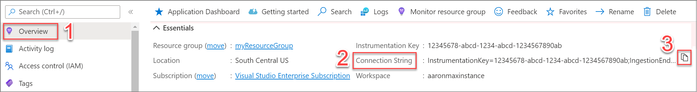
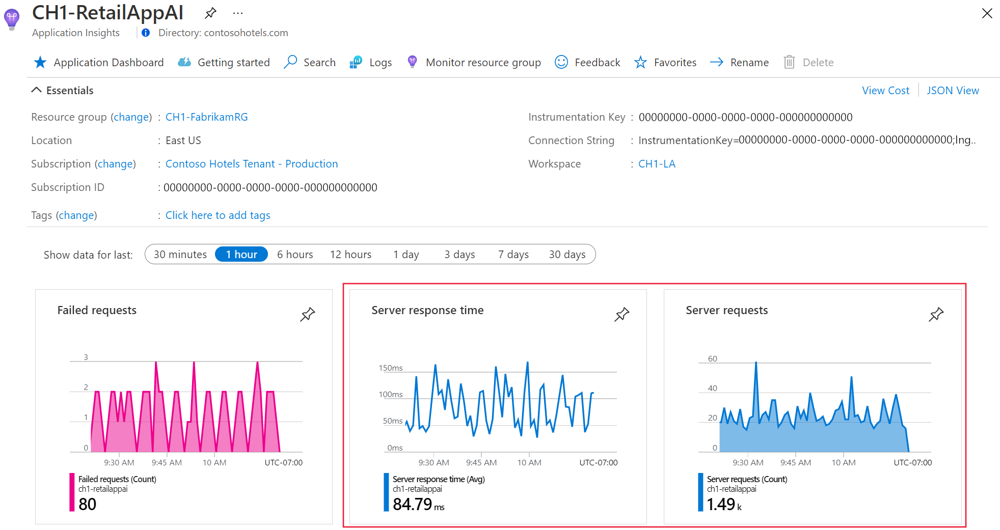

| Aula| SQL | API / MVC | auth | Monitoring |    Synch       | Infra     | Caching     |
| ---| --- | --- | --- | --- |    ---       | ---     | ---     |
| 1 | local | local |     -    |      -     |    síncrono    | az portal |     -       |
| 2 | CLOUD | local |     -    |      -     |    síncrono    | az portal |     -       |
| 3 | CLOUD | CLOUD |     -    |      -     |    síncrono    | az portal |     -       |
| 4 | CLOUD | CLOUD | MS ENTRA |      -     |    síncrono    | az portal |     -       |
| 5 | CLOUD | CLOUD | MS ENTRA | AZ MONITOR |    síncrono    | az portal |     -       |
| 6 | CLOUD | CLOUD | MS ENTRA | AZ MONITOR | MSG/ASSÍNCRONO | az portal |     -       |
| 7 | CLOUD | CLOUD | MS ENTRA | AZ MONITOR | MSG/ASSÍNCRONO | IAAC      |     -       |
| 8 | CLOUD | CLOUD | MS ENTRA | AZ MONITOR | MSG/ASSÍNCRONO | IAAC      | AZURE REDIS |


# Aula 5 - Habilitar o OpenTelemetry do Azure Monitor para aplicativos .NET

habilitar e configurar a coleta de dados baseada em OpenTelemetry no Azure Monitor Application Insights. Distribuições do OpenTelemetry do Azure Monitor:

- Fornece uma distribuição do OpenTelemetry que inclui suporte para recursos específicos do Azure Monitor.
- Habilita telemetria automática, incluindo bibliotecas de instrumentação OpenTelemetry para coletar rastreamentos, métricas, logs e exceções.
- Permite coletar telemetria personalizada.
- Oferece suporte ao recurso Live Metrics para monitorar e coletar mais telemetria de aplicativos Web ao vivo e em produção.

## Habilitar o OpenTelemetry com o Application Insights

### Instalar a biblioteca de clientes

Instale o pacote Azure.Monitor.OpenTelemetry.AspNetCoreNuGet mais recente:

```powershell
dotnet add package Azure.Monitor.OpenTelemetry.AspNetCore
```

### Modificar o aplicativo

Importe o Azure.Monitor.OpenTelemetry.AspNetCore namespace, adicione o OpenTelemetry e configure-o para usar o Azure Monitor em sua program.cs classe:

```csharp
// Import the Azure.Monitor.OpenTelemetry.AspNetCore namespace.
using Azure.Monitor.OpenTelemetry.AspNetCore;

var builder = WebApplication.CreateBuilder(args);

// Add OpenTelemetry and configure it to use Azure Monitor.
builder.Services.AddOpenTelemetry().UseAzureMonitor();

var app = builder.Build();

app.Run();
```

### Copie a string de conexão do seu recurso do Application Insights

A cadeia de conexão é exclusiva e especifica para onde as Distribuições do OpenTelemetry do Azure Monitor enviam a telemetria coletada.

Para copiar a cadeia de conexão:

- Acesse o painel Visão geral do recurso Application Insights.
- Encontre sua cadeia de conexão.
- Passe o mouse sobre a cadeia de conexão e selecione o ícone Copiar para a área de transferência.



### Colar a cadeia de conexão em seu ambiente

APPLICATIONINSIGHTS_CONNECTION_STRING=<Your connection string>

### Confirmar se os dados estão fluindo

Abra o seu aplicativo e, em seguida, abra o Application Insights no portal do Azure. Pode levar alguns minutos para os dados aparecerem.




