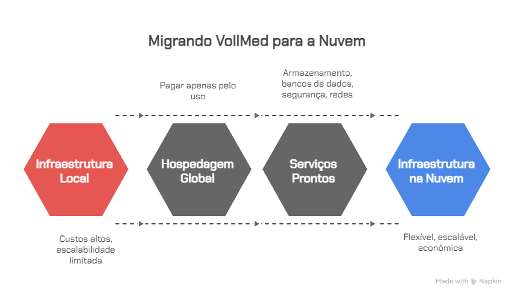

# Vídeo 1.2 – O que é Computação em Nuvem e por que usar

Contexto: 
Você acabou de finalizar o desenvolvimento da aplicação VollMed, uma solução para clínicas médicas que gerencia médicos, pacientes e consultas. O modelo de negócio da empresa não se limita a uma cidade ou estado: a VollMed quer oferecer sua aplicação para clínicas em qualquer lugar do Brasil. Para que isso seja possível, precisamos garantir que a aplicação esteja disponível 24 horas por dia, que seja rápida, escalável conforme o número de usuários cresça e, ao mesmo tempo, que não custe uma fortuna em infraestrutura. 

Problema: 
Se tentássemos atender essa necessidade apenas com servidores locais (on-premise), enfrentaríamos desafios sérios: alto investimento inicial em hardware, custos contínuos de manutenção, dificuldade para escalar em momentos de pico e, ainda, limitações para levar a aplicação a diferentes regiões do Brasil. Isso poderia comprometer a experiência de clínicas e pacientes que acessam a plataforma. 

Solução: 
 É aqui que entra a computação em nuvem. Com ela, podemos hospedar a aplicação VollMed em provedores globais, pagando apenas pelo que usamos e garantindo que os recursos cresçam ou diminuam conforme a demanda. A nuvem nos oferece não apenas flexibilidade, mas também serviços prontos para armazenamento, bancos de dados, segurança e redes. 

Teoria: 
 Nesse vídeo, vamos entender os fundamentos da computação em nuvem: 

O que é e como funciona. 

Principais modelos de serviço (IaaS, PaaS, SaaS). 

As vantagens que ela traz, como elasticidade, alta disponibilidade e redução de custos. 