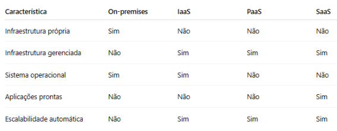
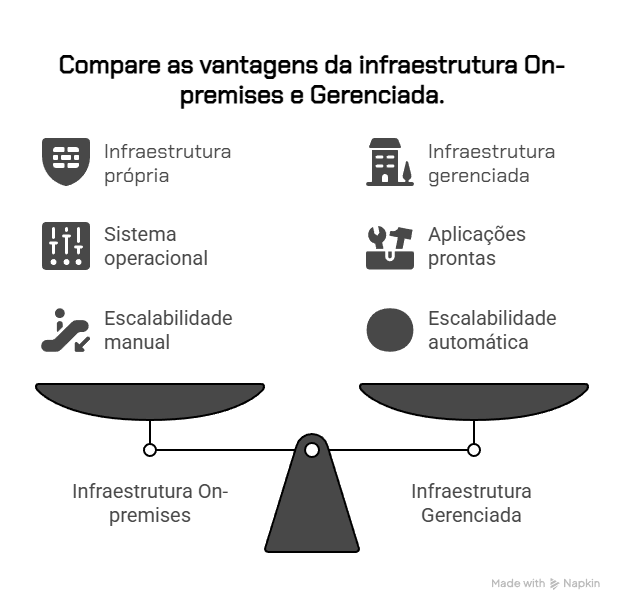

# Vídeo 1.3 – Modelos de Serviço: IaaS, PaaS e SaaS 

Contexto 
 A VollMed precisa decidir como vai usar a nuvem para hospedar sua aplicação. Existem diferentes formas de consumir recursos, cada uma com vantagens e responsabilidades diferentes. 

Problema 
Muitas vezes as equipes escolhem o modelo errado — e acabam gastando mais do que deveriam, ou assumindo responsabilidades desnecessárias. 

Solução 
Eis uma analogia. Pense em preparar um café da manhã. Você tem três opções: 

Comprar todos os ingredientes e fazer tudo do zero : mais trabalho, mas você controla tudo. (IaaS) 

Comprar uma mistura pronta e só adicionar água : equilíbrio entre praticidade e personalização. (PaaS) 

Pedir o café pronto no aplicativo : zero esforço, é só consumir. (SaaS) 

Essas três formas chegam no mesmo resultado (tomar café), mas variam no nível de esforço, controle e praticidade. O mesmo acontece com os modelos de nuvem. 

 

Teoria aplicada 

IaaS (Infraestrutura como Serviço): você gerencia servidores, rede e sistema operacional. Exemplo: criar uma VM no Azure e instalar manualmente o .NET. 

PaaS (Plataforma como Serviço): a nuvem já entrega um ambiente pronto para rodar sua aplicação. Exemplo: Azure App Service para publicar a aplicação VollMed em .NET sem se preocupar com servidor. 

SaaS (Software como Serviço): a aplicação já vem pronta, basta consumir. Exemplo: usar o Microsoft 365 para comunicação da equipe da VollMed. 

Encerramento 
 Cada modelo tem seu lugar — e cabe à equipe da VollMed (e a você como desenvolvedor) avaliar o que faz mais sentido em termos de custo, controle e agilidade. 