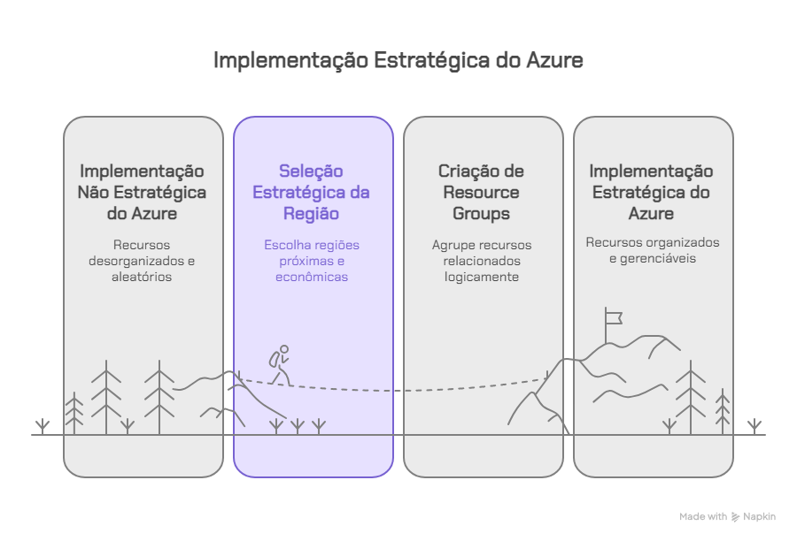

# Vídeo 1.4 – Regiões e Grupos de Recursos 

Contexto: 
 No projeto da VollMed, assim que vamos criar a primeira aplicação no Azure, já precisamos tomar duas decisões importantes: em qual região do mundo nossos recursos ficarão e como iremos organizá-los. 

Problema: 
 Se escolhermos uma região aleatória, podemos ter latência alta para os usuários do Brasil, pagar custos desnecessários ou até sofrer com indisponibilidade em caso de falha. Da mesma forma, se não organizarmos bem os recursos, rapidamente o ambiente se torna confuso e difícil de gerenciar. 

Solução: 
 Na prática, vamos aprender a selecionar uma região estratégica, considerando proximidade e custo, e também a criar Resource Groups para agrupar recursos relacionados da VollMed, como Web App, banco de dados e serviços de monitoramento. 

Teoria: 

Regiões: locais físicos onde os datacenters do Azure estão distribuídos pelo mundo. 

Zonas de disponibilidade: camadas extras de resiliência dentro de uma mesma região. 

Resource Groups: contêineres lógicos para organizar e gerenciar serviços de forma centralizada, simplificando implantação e manutenção. 