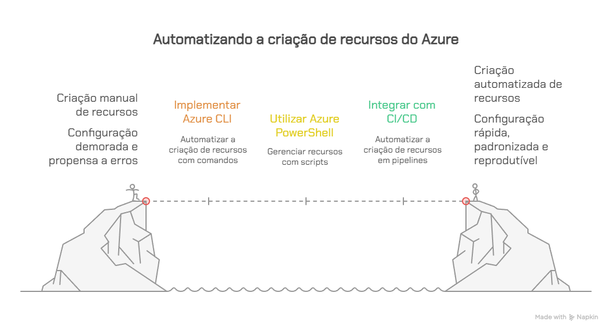

# Vídeo 1.6 – Automação com CLI e PowerShell 

Contexto: 
 A VollMed precisa garantir que seus recursos na nuvem sejam criados e configurados de forma rápida, padronizada e reprodutível. Para isso, além do Portal, existem ferramentas que permitem automatizar operações: o Azure CLI e o Azure PowerShell. 

Problema: 
 Depender apenas do Azure Portal não é escalável. Em ambientes corporativos, como o da VollMed, pode ser necessário criar vários ambientes (teste, homologação, produção), e repetir cada configuração manualmente aumenta risco de erro e perda de tempo. 

Solução: 
 Vamos apresentar o Azure CLI e o Azure PowerShell, mostrando como eles podem criar e gerenciar recursos de forma automatizada. No exemplo da VollMed, veremos como um desenvolvedor poderia criar rapidamente um Resource Group e uma conta de armazenamento, garantindo que a configuração seja consistente em qualquer ambiente. 

Teoria: 

Esses comandos seguem o conceito de Infraestrutura como Código (IaC). 

Benefícios: padronização, rapidez, integração com scripts e pipelines. 

Integração natural com CI/CD: a VollMed pode automatizar a criação de seus recursos diretamente em pipelines, garantindo ambientes sempre consistentes. 